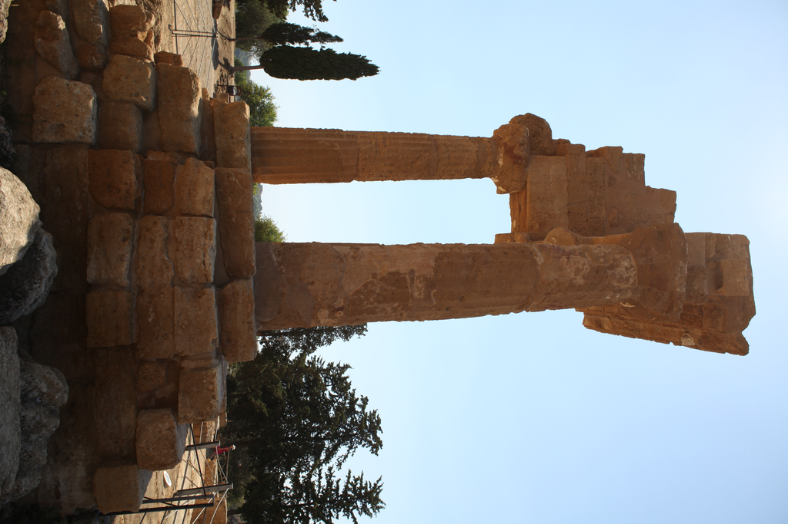
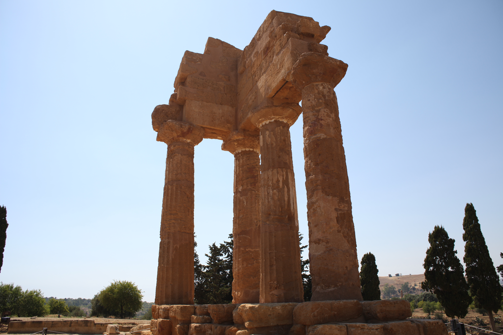
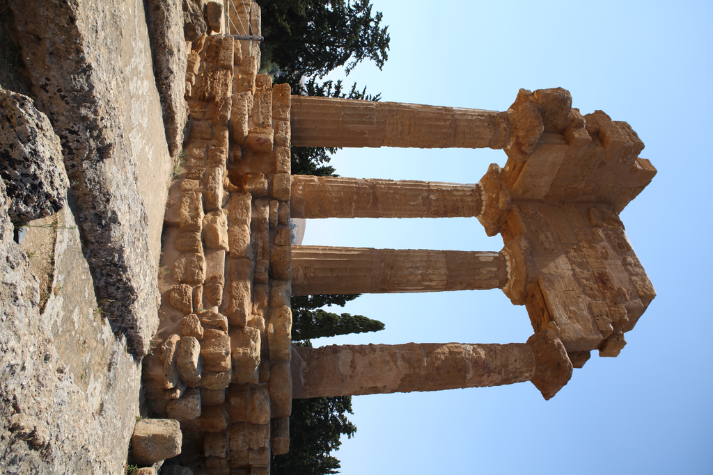
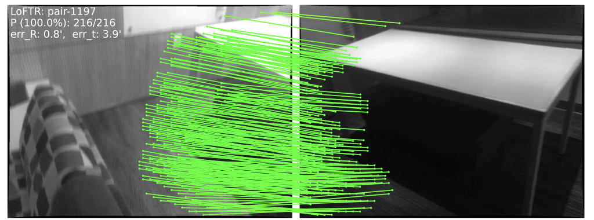
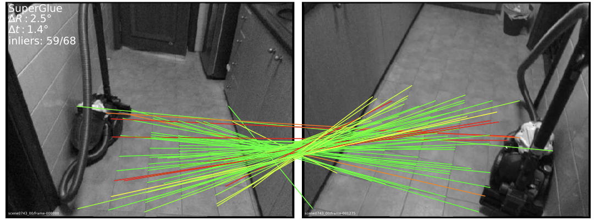
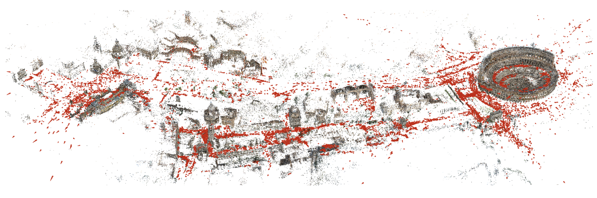

# Vision3D: State-of-the-Art 3D Reconstruction from Images

[](https://www.python.org/downloads/)
[](https://pytorch.org/)
[](LICENSE)
[](https://github.com/psf/black)

## 🚀 Overview

Vision3D is a one-step solution for 3D scene reconstruction from photographs.

Provide a folder of images, execute a single command, and obtain a high-quality 3D model.

```python
from vision3d import Vision3DPipeline

pipeline = Vision3DPipeline()

reconstruction = pipeline.reconstruct(
    "path/to/your/images",     # Folder containing .jpg / .png photos
    output_dir="output"        # Where to save the 3D model & reports
)
```


<table>
<tr>
<td width="50%">
<h4 align="center">Input: Multiple 2D Photos</h4>
<p align="center">





</p>
</td>
<td width="50%">
<h4 align="center">Output: 3D Reconstruction</h4>
<p align="center">

</p>
</td>
</tr>
</table>

**Key Features:**
- 🚀 **One-Step Reconstruction**: Generates a 3D model from raw images with a single python command
- 🔥 **Hybrid Matching**: Intelligently combines LoFTR (dense) and SuperGlue (sparse) matching
- 🎯 **Smart Image Pairing**: Efficiently selects which images to match
- 📊 **Performance Optimized**: GPU acceleration, multi-scale processing, and smart caching
- 🛠️ **Easy to Understand**: Extensive documentation and comments for learning

## 📋 Table of Contents

- [Core Technologies](#-core-technologies)
- [Installation](#-installation)
- [Quick Start](#-quick-start)
- [Advanced Usage](#-advanced-usage)
- [Performance](#-performance)
- [API Reference](#-api-reference)
- [Troubleshooting](#-troubleshooting)
- [Contributing](#-contributing)
- [Citation](#-citation)

## 🧩 Core Technologies


#### 1. [LoFTR (Local Feature TRansformer)](https://arxiv.org/abs/2104.00680)
LoFTR is a detector-free local feature matcher that leverages transformer self-attention to predict dense, pixel-level correspondences between two images. By reasoning about global context instead of isolated keypoints, it remains reliable on texture-poor surfaces, repetitive facades and under difficult lighting — scenarios that often break classical detectors.

<p align="center"></p>

#### 2. [SuperGlue](https://arxiv.org/abs/1911.11763)
SuperGlue refines traditional keypoints into high-quality matches by passing them through a graph neural network that jointly reasons over appearance and spatial relationships. This results in fast, globally consistent correspondences that excel on large, well-textured scenes where speed is paramount.

<p align="center"></p>

#### 3. [COLMAP](https://colmap.github.io/)
COLMAP is the structure-from-motion backbone that turns 2D correspondences into an accurate, metrically scaled 3D model. Through incremental reconstruction, precise camera pose estimation and global bundle adjustment, it delivers industry-standard robustness and accuracy even on challenging, large-scale datasets.

<p align="center"></p>

### Real-World Applications

- 📱 **AR/VR**: Creating 3D environments for virtual reality
- 🚗 **Autonomous Vehicles**: Understanding 3D surroundings from cameras
- 🏛️ **Cultural Heritage**: Preserving historical sites in 3D
- 🎮 **Gaming**: Creating 3D assets from photographs
- 🏗️ **Construction**: Monitoring building progress with drones

### Pipeline

The 3D reconstruction pipeline follows these steps:

1. **Image Loading**: Load all input images from the specified directory
2. **Global Feature Extraction**: Extract image-level descriptors using EfficientNet for similarity comparison
3. **Pair Selection**: Intelligently select image pairs based on similarity scores (avoiding unnecessary comparisons)
4. **Feature Matching**: 
   - Use LoFTR for dense matching on challenging scenes
   - Use SuperGlue for fast sparse matching on larger datasets
   - Apply multi-scale processing and test-time augmentation for robustness
5. **COLMAP Reconstruction**:
   - Initialize reconstruction with the best image pair
   - Incrementally add new images, estimating camera poses
   - Triangulate 3D points from matched features
   - Perform bundle adjustment to optimize camera parameters and 3D points
6. **Export Results**: Save the 3D model as PLY file and camera parameters as JSON

### System Architecture

```
vision3d/
├── 📁 core/                    # Core pipeline components
│   ├── pipeline.py            # Main orchestrator - coordinates everything
│   ├── reconstruction.py      # 3D reconstruction engine
│   └── feature_extraction.py  # Feature detection and description
│
├── 📁 models/                  # Deep learning models
│   ├── loftr.py              # LoFTR: transformer-based dense matching
│   ├── superglue.py          # SuperGlue: GNN-based sparse matching
│   └── base.py               # Common interface for all matchers
│
├── 📁 utils/                   # Helper utilities
│   ├── image_pairs.py        # Smart pair selection algorithms
│   ├── colmap_interface.py   # COLMAP database management
│   └── visualization.py      # 3D visualization tools
│
└── 📁 examples/               # Learn by example!
    ├── basic_reconstruction.py
    ├── advanced_matching.py
    └── tutorial.ipynb
```

## 💻 Installation

### Prerequisites

- Python 3.8+
- CUDA 10.2+ (for GPU support)
- COLMAP 3.7+

### Step 1: Clone Repository

```bash
git clone https://github.com/yourusername/vision3d.git
cd vision3d
```

### Step 2: Create Environment

```bash
# Using conda (recommended)
conda create -n vision3d python=3.8
conda activate vision3d

# Or using venv
python -m venv venv
source venv/bin/activate  # On Windows: venv\Scripts\activate
```

### Step 3: Install Dependencies

```bash
# Install PyTorch (adjust for your CUDA version)
pip install torch==1.10.0+cu113 torchvision==0.11.0+cu113 -f https://download.pytorch.org/whl/torch_stable.html

# Install other dependencies
pip install -r requirements.txt

# Install COLMAP
# Ubuntu/Debian
sudo apt-get install colmap

# macOS
brew install colmap
```


## 🚀 Quick Start

### Basic Usage

```python
from vision3d import Vision3DPipeline

# Initialize pipeline
pipeline = Vision3DPipeline(matcher_type='hybrid')

# Run reconstruction from a directory of images
reconstruction = pipeline.reconstruct(
    "path/to/images",     # Directory containing images
    output_dir="output"   # Where to save results
)

# Or use a list of specific image paths
images = ['img1.jpg', 'img2.jpg', 'img3.jpg']
reconstruction = pipeline.reconstruct(
    images,
    output_dir="output"
)
```

### Command Line Interface

```bash
# Basic reconstruction using the simple script
python reconstruct.py ./images ./output

# Or if no arguments provided, uses default paths:
# - Input: examples/images
# - Output: ./featureout
python reconstruct.py
```

## 🔬 Advanced Usage

### Custom Configuration

```python
config = {
    'image_resize': 1440,
    'pair_selection': {
        'min_pairs': 30,
        'similarity_threshold': 0.5
    },
    'matching': {
        'confidence_threshold': 0.3,
        'use_tta': True,
        'tta_variants': ['orig', 'flip_lr', 'rot_90']
    }
}

pipeline = Vision3DPipeline(config=config)
```

### Using Specific Matchers

```python
from vision3d.models import LoFTRMatcher, SuperGlueMatcher

# LoFTR for challenging indoor scenes
loftr = LoFTRMatcher(device='cuda')
kpts1, kpts2, conf = loftr.match_pair('img1.jpg', 'img2.jpg')

# SuperGlue for outdoor scenes with more keypoints
superglue = SuperGlueMatcher(device='cuda')
kpts1, kpts2, conf = superglue.match_pair(
    'img1.jpg', 'img2.jpg'
)
```

### Multi-Scale Matching

```python
# Match at multiple scales for better coverage
matcher = LoFTRMatcher(device='cuda')
kpts1, kpts2, conf = matcher.match_multi_scale(
    'img1.jpg', 'img2.jpg',
    scales=[640, 1024, 1440]
)
```

### Visualization

```python
from vision3d.utils.visualization import visualize_matches, visualize_reconstruction

# Visualize matches
visualize_matches(img1, img2, kpts1, kpts2, 'matches.png')

# Visualize 3D reconstruction
visualize_reconstruction(reconstruction, 'reconstruction.html')
```

## 📖 API Reference

### Vision3DPipeline

Main pipeline class for 3D reconstruction.

```python
class Vision3DPipeline:
    def __init__(self, config=None, matcher_type='hybrid', device=None):
        """Initialize the pipeline.
        
        Args:
            config: Configuration dictionary
            matcher_type: Type of matcher ('loftr', 'superglue', 'hybrid')
            device: Device for computation ('cuda', 'cpu', or torch.device)
        """
        
    def reconstruct(self, image_path, output_dir='./output', image_pairs=None, 
                   skip_pair_selection=False, skip_feature_extraction=False, 
                   skip_reconstruction=False, verbose=True):
        """Perform 3D reconstruction.
        
        Args:
            image_path: Path to image directory or list of image paths
            output_dir: Output directory for results
            image_pairs: Optional pre-computed image pairs
            skip_pair_selection: Skip automatic pair selection
            skip_feature_extraction: Skip feature extraction
            skip_reconstruction: Skip 3D reconstruction
            verbose: Show progress information
            
        Returns:
            Dictionary containing reconstruction results
        """
        
    def export_results(self, reconstruction, output_path, formats=None):
        """Export reconstruction results.
        
        Args:
            reconstruction: Reconstruction object
            output_path: Output path
            formats: List of export formats ['ply', 'json', 'nvm']
        """
```

### Matchers

Base interface for all matchers:

```python
class BaseMatcher:
    def match_pair(self, image1_path, image2_path, **kwargs):
        """Match features between two images.
        
        Args:
            image1_path: Path to first image
            image2_path: Path to second image
            **kwargs: Additional matcher-specific arguments
            
        Returns:
            kpts1: Keypoints in image 1 (N x 2)
            kpts2: Keypoints in image 2 (N x 2)
            confidence: Match confidence scores (N,)
        """
        
    def match_pairs(self, image_paths, pairs, output_dir=None, verbose=True):
        """Match features for multiple image pairs.
        
        Args:
            image_paths: List of image paths
            pairs: List of (idx1, idx2) pairs to match
            output_dir: Optional directory to save matches
            verbose: Show progress
            
        Returns:
            Dictionary mapping (idx1, idx2) to match data
        """
```

## 🛠️ Troubleshooting

### Common Issues

1. **CUDA Out of Memory**
   ```python
   # Reduce image size or batch size
   config = {'image_resize': 800, 'batch_size': 1}
   ```

2. **Poor Reconstruction Quality**
   - Ensure sufficient image overlap (>60%)
   - Check image quality and lighting
   - Try different matcher configurations

3. **COLMAP Errors**
   - Verify COLMAP installation: `colmap -h`
   - Check database permissions
   - Ensure image paths are correct

## 🤝 Contributing

We welcome contributions! Please see our [Contributing Guide](CONTRIBUTING.md) for details.